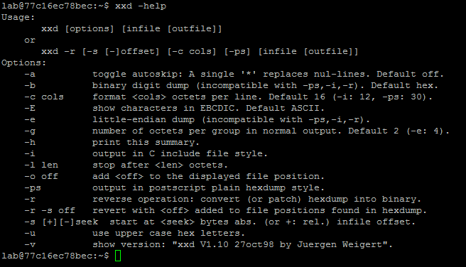
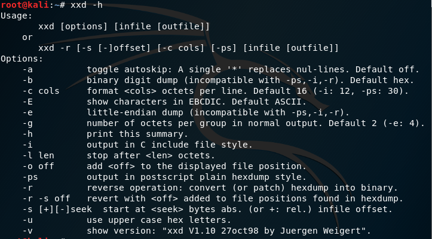

# 安全連線:

### Windows: putty 

### Linux ssh

# 第一題

BreakALLCTF{Sobkjgd14VuIFBUtgVts}
30714 康迦舜

# 第二題

BreakALLCTF{WucLSg4cxPNYuXFF5XxJ}
30714 康迦舜

# 第三題

BreakALLCTF{GIUWO1rpMhJCJpACvVwr}
30714 康迦舜

# 第四題

BreakALLCTF{XvXeVX5Ae9FwnYmDV2jU}
30714 康迦舜

# 第五題

BreakALLCTF{TPLGKbWxmutGtecSSpo1}
30714 康迦舜

# 第六題

BreakALLCTF{YUA7D5D0k4elbQ1XqH14}
30714 康迦舜

# 第七題

BreakALLCTF{Ef94iSQPRI66Ws4ECqV9}
30714 康迦舜

# 第八題
BreakALLCTF{U6TLCzQsk73HwcW7rqAW}
30714 康迦舜

# 第九題
BreakALLCTF{UvB3IUqxCCiTVxeOuWrL}
30714 康迦舜
 
# 第十題
BreakALLCTF{VLJekKONoWld7ari6HHJ}
30714 康迦舜
